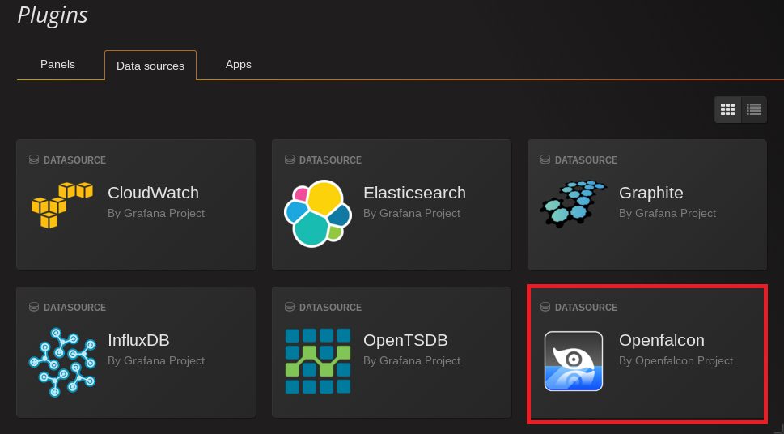
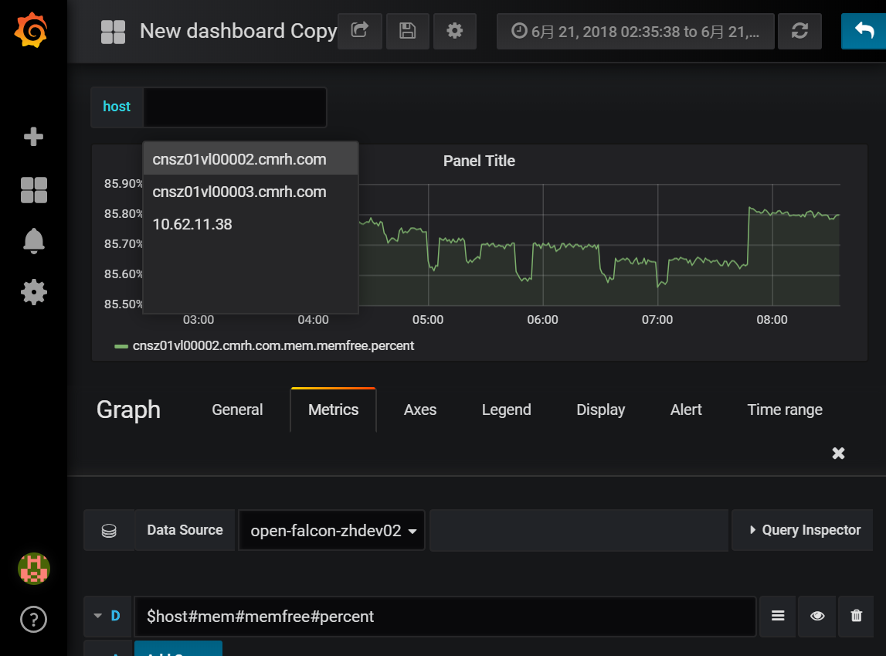

# Open-Falcon plugin for Grafana

[Open-Falcon](https://github.com/open-falcon/falcon-plus) is an open-source, enterprise-level, and large-scale service monitoring system and time series database. It's initially released by Xiaomi SRE team in 2015 and heavily used in Xiaomi. Open-Falcon is now one of the most popular monitoring system in China internet companies.

# Installation

### Download prebuild version of grafana on official site
[https://grafana.com/grafana/download](https://grafana.com/grafana/download) `Grafana v3.0 or newer(test passed on v5.0.3)`

**or you can install grafana via homebrerw:**

```
brew update 
brew install grafana
```

### Checkout the plugin
```
cd {GRAFANA_PATH_Installed}/data/plugins
git clone https://github.com/open-falcon/grafana-openfalcon-datasource
```

### Start grafana-server
```
{GRAFANA_PATH_Installed}/bin/grafana-server
```

If you have started grafana-server, you have to restart it after installing plugins.

# After Installation
If the installation is successful, Open-Falcon datasource would be shown as follow:


# How to Set up datasource
* the backend services is provide by [falcon-plus](https://github.com/open-falcon/falcon-plus/tree/master/modules/api).


# Work with variables

When you select metrics, you can use variables if you "Toggle Edit Mode", e.g. `$host#mem#memfree#percent` is ok.

